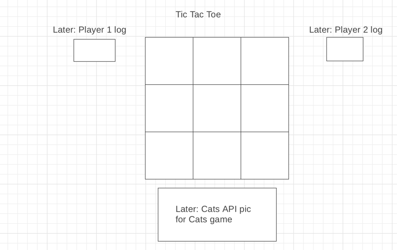

2 player tic-tac-toe Game!
- The Sith lord (Red) will attack first.  The Jedi Master is represented by red.
- The goal is to get three in a row, column or diagonal before the other player!
- If both players can't get three in a row, column or diagonal it will be a cat's game!
- Each game will be alerted to a winner, or a cat's game.

Used JavaScript, CSS, and HTML.

